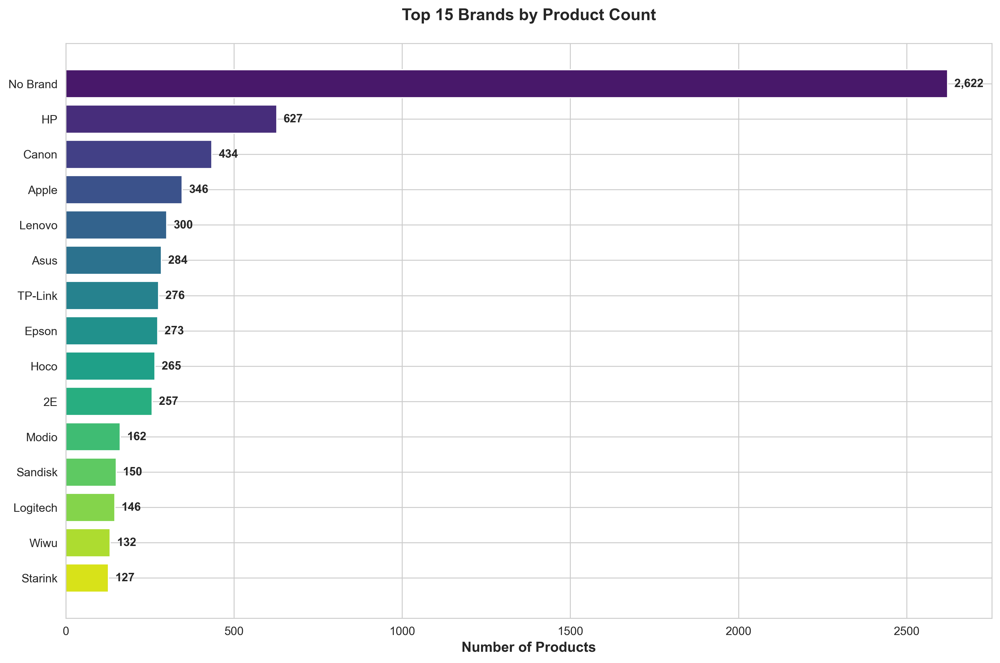
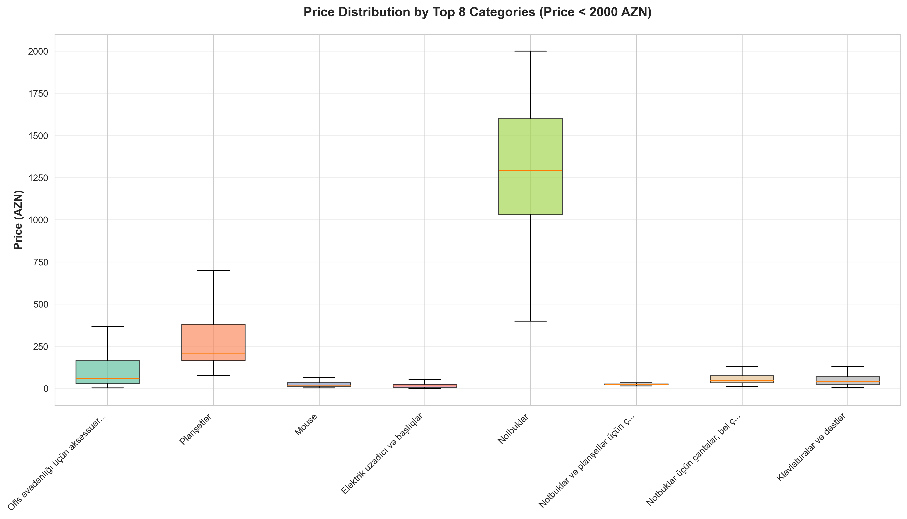
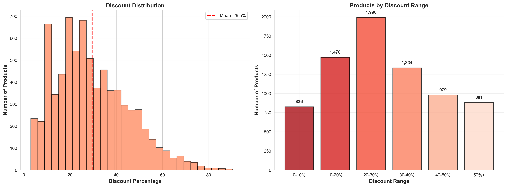
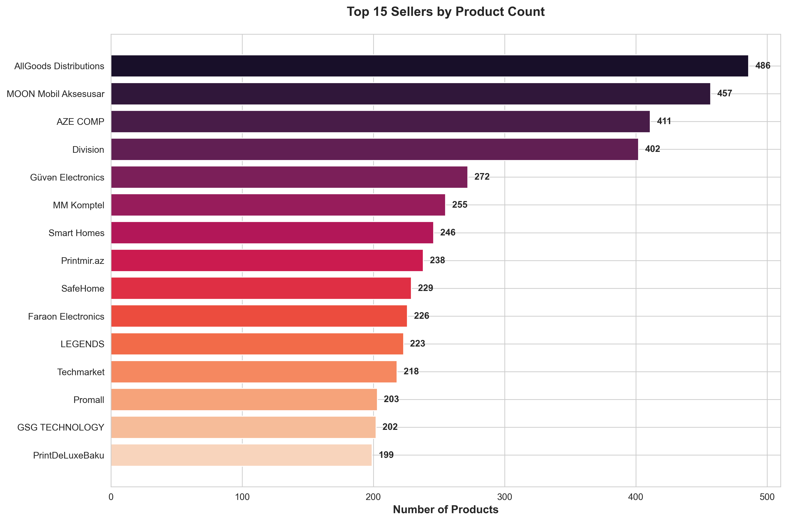
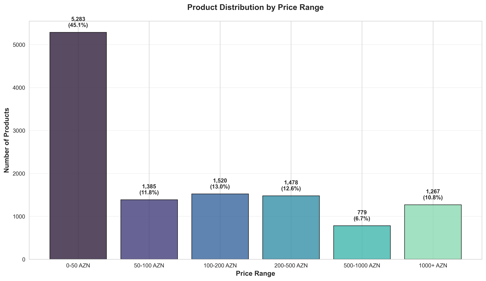
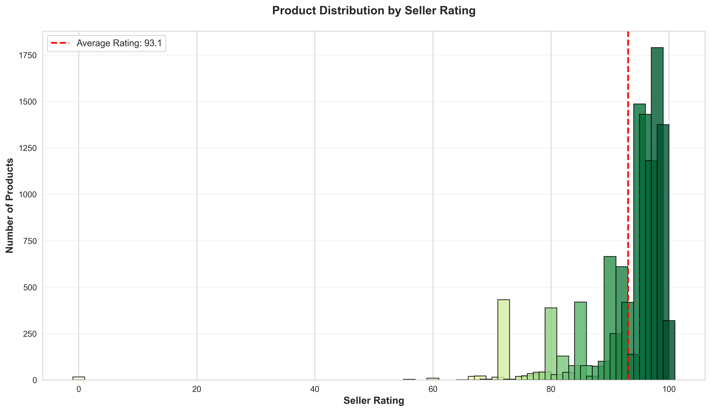
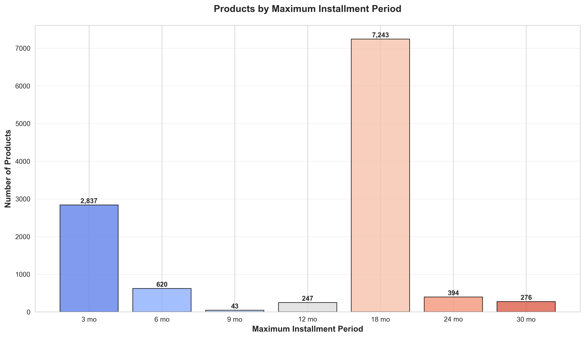
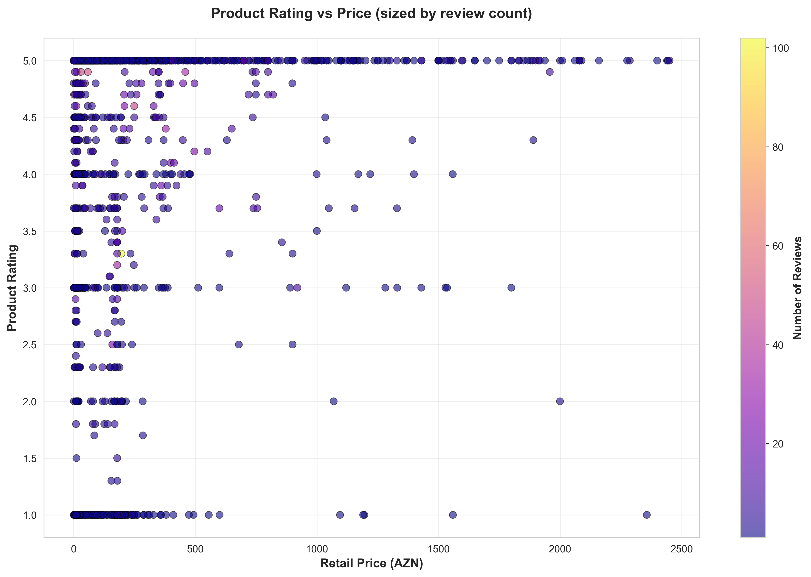
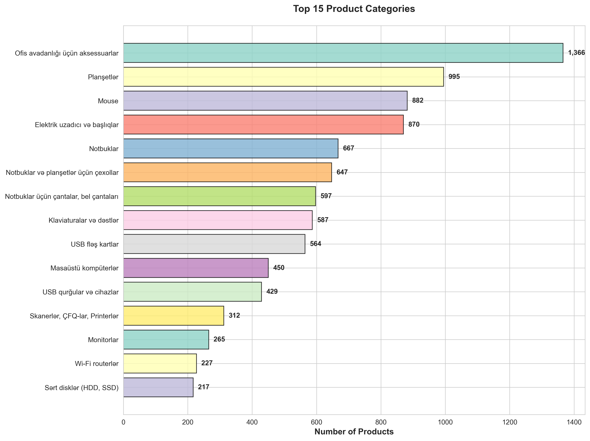
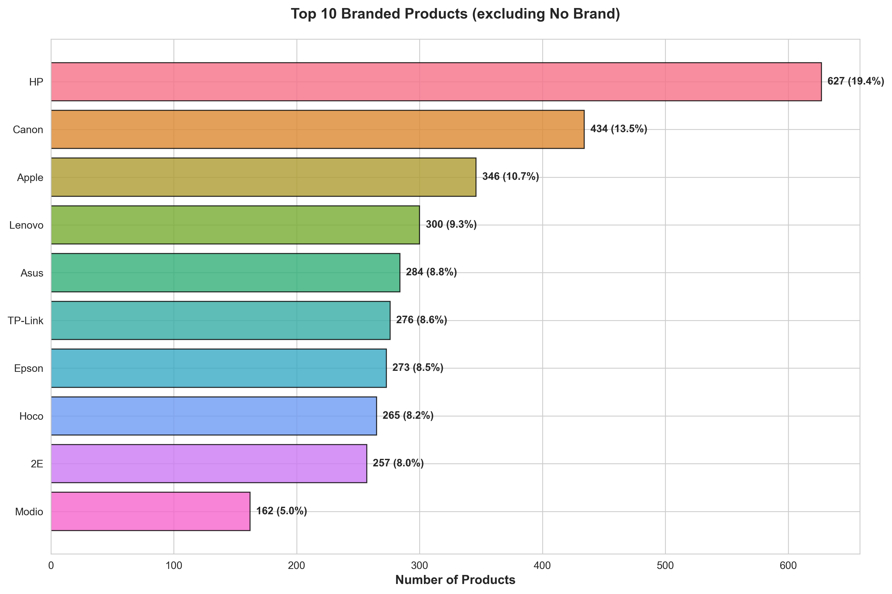

# Umico Marketplace Analysis

Comprehensive market analysis of **11,712 products** from Umico marketplace, revealing pricing strategies, brand positioning, and consumer trends.

---

## 📊 Market Overview

- **Total Products Analyzed**: 11,712
- **Average Price**: 354.41 AZN
- **Median Price**: 69.00 AZN
- **Price Range**: 0.45 AZN - 23,281.65 AZN

---

## 💰 Pricing & Discounts

- **Products with Discounts**: 7,480 (63.9%)
- **Average Discount Rate**: 29.5%
- **Most Common Discount Range**: 20-30%
- **Maximum Discount Observed**: Up to 90%+

**Key Insight**: Nearly two-thirds of products offer discounts, with an average savings of 30%. This indicates aggressive competitive pricing in the marketplace.

---

## 🏆 Market Leaders

- **Top Brand**: HP (627 products)
- **Top Category**: Office Accessories (1,366 products)
- **Top Seller**: AllGoods Distributions (486 products)
- **Average Seller Rating**: 93.1/100

**Key Insight**: HP dominates the branded product space, while office accessories represent the largest category, indicating strong B2B/office supply demand.

---

## 💳 Payment Flexibility

- **Products with Installments**: 11,660 (99.6%)
- **Most Common Installment Period**: 18 months
- **Installment Range**: 3-30 months

**Key Insight**: Near-universal installment availability with flexible terms up to 30 months indicates a strong focus on purchase accessibility.

---

## 🏷️ Brand Analysis

**Top 5 Branded Products (excluding generic)**:
1. HP - 627 products (11.1%)
2. Canon - 434 products (7.7%)
3. Apple - 346 products (6.1%)
4. Lenovo - 300 products (5.3%)
5. Asus - 284 products (5.0%)

**Key Insight**: Technology brands dominate, with HP and Canon leading office and printing solutions market share.

---

## 📱 Category Distribution

**Top 5 Categories**:
1. Office Equipment Accessories - 1,366 products (11.7%)
2. Tablets - 995 products (8.5%)
3. Mouse Devices - 882 products (7.5%)
4. Power Strips & Extensions - 870 products (7.4%)
5. Laptops - 667 products (5.7%)

**Key Insight**: Strong focus on office/productivity accessories alongside core computing devices (tablets, laptops).

---

## 💵 Price Segmentation

**Product Distribution by Price**:
- **Budget (0-50 AZN)**: 5,462 products (46.6%)
- **Mid-Range (50-200 AZN)**: 3,689 products (31.5%)
- **Premium (200-1000 AZN)**: 2,056 products (17.6%)
- **Luxury (1000+ AZN)**: 505 products (4.3%)

**Key Insight**: Nearly half of all products are budget-friendly (under 50 AZN), indicating accessibility-focused market positioning.

---

## ⭐ Seller Quality

- **High-Rated Sellers (90-100)**: Majority of products
- **Average Seller Rating**: 93.1/100
- **Rating Distribution**: Strong concentration at 95-99 range

**Key Insight**: High seller ratings across the board indicate strong quality control and customer satisfaction standards.

---

## Data Visualizations

### 1. Top 15 Brands by Product Count

**Business Value**: Identifies market leaders and brand diversity. HP, Canon, and Apple dominate the marketplace, indicating strong consumer preference for established tech brands.

---

### 2. Price Distribution by Top Categories

**Business Value**: Shows pricing strategies across categories. Wide price ranges in laptops vs. accessories indicate different market segments and profit margins.

---

### 3. Discount Distribution Analysis

**Business Value**: Reveals competitive pricing strategies. The concentration of 20-40% discounts suggests strategic promotional pricing rather than clearance sales.

---

### 4. Top 15 Sellers by Product Count

**Business Value**: Identifies key marketplace partners. AllGoods Distributions and MOON Mobil Aksesuار lead in product variety, indicating major distribution partnerships.

---

### 5. Product Distribution by Price Range

**Business Value**: Market segmentation analysis. The heavy concentration in 0-50 AZN range indicates a mass-market focus with accessibility as a priority.

---

### 6. Seller Rating Distribution

**Business Value**: Quality assurance metrics. High concentration of 95+ ratings demonstrates marketplace quality standards and customer satisfaction.

---

### 7. Installment Options Analysis

**Business Value**: Payment flexibility trends. 18-month installments dominate, balancing affordability with reasonable payback periods.

---

### 8. Product Rating vs Price Analysis

**Business Value**: Quality-price correlation. Highly-rated products exist across all price points, indicating that quality isn't solely determined by price.

---

### 9. Top 15 Product Categories

**Business Value**: Category performance metrics. Office accessories and peripherals outperform core computing devices, suggesting strong recurring revenue from accessories market.

---

### 10. Brand Market Share (Top 10)

**Business Value**: Competitive landscape analysis. HP's 11% market share among branded products shows market fragmentation with opportunities for brand partnerships.

---

## Business Applications

This analysis provides actionable insights for:

1. **Competitive Intelligence** - Monitor competitor pricing and product strategies
2. **Market Research** - Identify trending categories and brands
3. **Pricing Strategy** - Benchmark pricing against market averages
4. **Inventory Planning** - Understand product diversity and category distribution
5. **Seller Analysis** - Evaluate seller performance and ratings
6. **Consumer Insights** - Analyze price sensitivity and discount patterns
7. **Partnership Opportunities** - Identify top-performing brands and sellers

---

**Last Updated**: December 2025
**Data Source**: Umico Marketplace
**Total Products Analyzed**: 11,712
